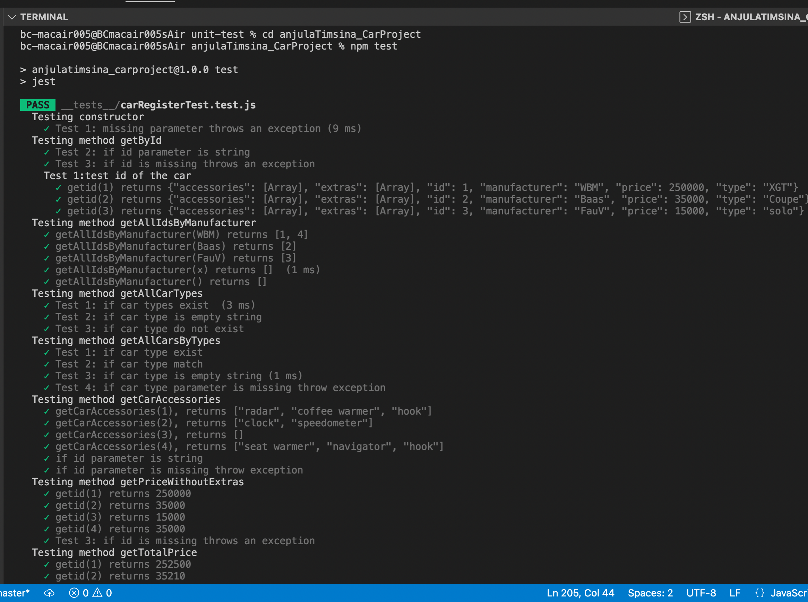

## Create a folder for the testproject

- create a folder for project
- use **datastorage.json** as a data source
- create **package.json**
  - **`npm init -y`**
- install **jest** as development dependency
  - **`npm install jest --save-dev`**
- create folder **tests** for tests
- edit the test script in the **package.json**

```json
  "scripts": {
    "test": "jest"
  }
```

## screenshot of project testing



## Design test cases in separate .md -file

## Car data

Data will be in a json file.

### datastorage.json

```json
[
  {
    "id": 1,
    "manufacturer": "WBM",
    "type": "XGT",
    "accessories": ["radar", "coffee warmer", "hook"],
    "price": 250000,
    "extras": [
      {
        "name": "winter tires",
        "price": 1500
      },
      {
        "name": "summer tires",
        "price": 1000
      }
    ]
  },
  {
    "id": 2,
    "manufacturer": "Baas",
    "type": "Coupe",
    "accessories": ["clock", "speedometer"],
    "price": 35000,
    "extras": [
      {
        "name": "manual",
        "price": 10
      },
      {
        "name": "warranty",
        "price": 200
      }
    ]
  },
  {
    "id": 3,
    "manufacturer": "FauV",
    "type": "solo",
    "accessories": [],
    "price": 15000,
    "extras": []
  }
]
```

## Constructor

### **constructor(jsonData)**

The data storage json object is passed as a parameter to the constructor. If the parameter is missing, constructor throws an error `'data storage missing'`.

## Methods

- **getById(id)**
  Method searches the datastorage for an object with given key. Key is unique.

  - Parameters: id of the car
  - Return: returns the car object matching the id or null if there is no match
  - if parameter is missing, throws an exception `'parameter missing'`

- **getAllIdsByManufacturer(value)**
  Returns all ids of the cars matching the value of manufacturer

  - Parameters: value of the property to be searched
  - Return: Returns an array of car id where the cars manufacturer matches the given value. If there is no match or parameter is missing, an empty array is returned.

- **getAllCarTypes()**
  Returns an array of different car types.

  - Parameters: none
  - Return: Returns an array of different car types. If no types are found, returns an empty array. The type is added to the result array only once.

- **getAllCarsByType(type)**
  Returns an array of car objects of given type

  - Parameters: type of the car to be searched
  - Returns an array of car objects of given type. If no car of given type is found, returns an empty array.
  - If a parameter type is missing, an exeption **'missing parameter'** is thrown.

- **GetCarAccessories(id)**
  Returns an array of car accessories. If none found, returns an empty array.

  - Parameters: id of the car
  - Return: returns accessories as an array

- **getPriceWithoutExtras(id)**
  Returns the price with out extras

  - Parameters: id of the car
  - Return: The price of the car not including the price of the extras
  - if no car with the given number is found throws an exeption `nothing found with given id`

- **getTotalPrice(id)**
  Returns the total price of the car including the total price of the extras

  - Parameters: id of the car
  - Return: The price of the car including the total price of the extras
  - if no car with the given number is found throws an exeption `nothing found with given id`

- **getPriceOfTheExtras(id)**
  Returns the total price of extras bunled with the car

  - Parameters: id of the car to be searched
  - Return: the total price of extras. If no extras is found returns 0
  - if no car with the given number is found throws an exeption `nothing found with given id`

- **hasAccessories(id)**
- Parameters: id of the car
- Return: returns true if the car has accessories else returns false. If parameter id is missing false is returned
